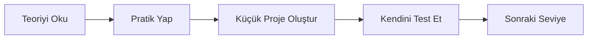

# Yapay Zeka ile Programlama Müfredatı 🤖💻

[](https://github.com/celalaksu/Yapay-Zeka-ile-Programlama-M-fredat-)
[](https://github.com/celalaksu/Yapay-Zeka-ile-Programlama-M-fredat-/fork)

## 📖 Proje Hakkında

Bu repo, **yapay zeka destekli öğrenme** yaklaşımıyla programlama dillerini öğrenmek isteyenler için hazırlanmış kapsamlı bir müfredat koleksiyonudur. Modern öğrenme metodolojileri ve en iyi pratikleri içeren detaylı kılavuzlar sunar.

Repo, şu anda **Python** ve **Rust** programlama dilleri için detaylı müfredatlar içermektedir. Her müfredat, başlangıçtan ileri seviyeye kadar yapılandırılmış öğrenme yolları sunar.

## 🎯 Amaç ve Hedefler

Bu projenin temel amaçları:

- ✅ Yapay zeka çağında programlama öğrenmeye modern bir yaklaşım sunmak
- ✅ Teori ve pratik dengesini koruyarak etkin öğrenmeyi desteklemek
- ✅ IDE ve geliştirme araçlarının tam potansiyeliyle kullanılmasını öğretmek
- ✅ Gerçek dünya projelerine hazırlık yapmak
- ✅ Best practices ve coding standards'ları baştan öğretmek

## 📂 Repo Yapısı

```
Yapay-Zeka-ile-Programlama-M-fredat-/
├── python/
│   └── python.md          # Python kapsamlı müfredatı
└── rust/
    └── rust.md            # Rust kapsamlı müfredatı
```

## 🐍 Python Müfredatı

[Python Müfredatı](python/python.md) dosyası, Python programlama dilini öğrenmek için aşağıdaki konuları kapsar:

### Kapsam
- **Temel seviyeden ileri seviyeye** yapılandırılmış öğrenme yolu
- **REPL ve Jupyter Notebook** kullanımı
- **PEP 8** standartları ve Pythonic kod yazma
- **Virtual environments** ve proje yönetimi
- **Debugging** araçları ve teknikleri
- **Type hints** ve modern Python özellikleri

### Öne Çıkan Özellikler
- İnteraktif öğrenme yaklaşımı
- IDE özellikleri ve kısayol tuşları
- Linting (Pylint, Flake8) ve formatting (Black)
- Proje bazlı öğrenme metodolojisi
- Her seviye sonunda değerlendirme soruları

### 🎓 Video Eğitim
Python'u sıfırdan öğrenmek için **video eğitim** almak isterseniz:

👉 [**Sıfırdan Orta Seviye Python ile Programlama Temelleri** - Udemy Kursu](https://www.udemy.com/course/sfrdan-orta-seviye-python-ile-programlama-temelleri/?referralCode=6CCA29CAD3C254A3EBC7)

Bu kurs, müfredattaki konuları görsel ve interaktif şekilde öğrenmenize yardımcı olacaktır.

[Python Müfredatına Git →](python/python.md)

## 🦀 Rust Müfredatı

[Rust Müfredatı](rust/rust.md) dosyası, Rust programlama dilini öğrenmek için aşağıdaki konuları kapsar:

### Kapsam
- **Ownership** sistemi ve benzersiz Rust kavramları
- **Cargo** proje yönetim aracı kullanımı
- **rust-analyzer** ve gelişmiş IDE özellikleri
- **rustfmt** ile kod formatlama
- **Clippy** ile kod analizi
- **Gerçek dünya projeleri** için hazırlık

### Öne Çıkan Özellikler
- Rust'a özgü kavramların derinlemesine öğretimi
- Memory safety ve performans odaklı yaklaşım
- Modern tooling kullanımı
- Debugging ve profiling teknikleri
- Ownership sistemi merkezli düşünme alışkanlığı

[Rust Müfredatına Git →](rust/rust.md)

## 🚀 Nasıl Kullanılır?

### Başlangıç İçin
1. Öğrenmek istediğiniz programlama dilinin klasörüne gidin
2. İlgili `.md` dosyasını açın
3. "Genel Öğrenme Yaklaşımı" bölümünü okuyun
4. Seviye seviye ilerleyin

### Öğrenme Süreci


Her müfredat şu şekilde yapılandırılmıştır:
1. **Öğrenme Metodolojisi**: Nasıl öğrenilmeli?
2. **IDE Kullanım İpuçları**: Araçları maksimum verimle kullanma
3. **Değerlendirme Soruları**: Kendini test etme
4. **Seviye Bazlı İçerik**: Başlangıçtan ileri seviyeye konular
5. **Proje Önerileri**: Her seviye için uygulamalı projeler

## 💡 Öğrenme Metodolojisi

Bu müfredat, modern ve etkili öğrenme prensiplerini temel alır:

### 1. **Teori + Pratik Dengesi**
- Önce kavramları anlayın
- Ardından hemen pratiğe geçin
- Küçük projelerle pekiştirin

### 2. **IDE Odaklı Yaklaşım**
- Geliştirme araçlarını etkin kullanma
- Debugging ve profiling
- Auto-completion ve IntelliSense

### 3. **Best Practices**
- Kod standartları
- Clean code prensipleri
- Version control kullanımı

### 4. **Community Engagement**
- Stack Overflow kullanımı
- Open source katkı
- Code review alışkanlığı

## 🛠️ Önerilen Araçlar

### Python İçin
- **IDE**: VS Code, PyCharm, Jupyter Notebook
- **Linter**: Pylint, Flake8, mypy
- **Formatter**: Black, autopep8
- **Package Manager**: pip, conda
- **Virtual Environment**: venv, virtualenv

### Rust İçin
- **IDE**: VS Code, RustRover, IntelliJ IDEA
- **Toolchain**: rustup, cargo
- **Linter**: Clippy
- **Formatter**: rustfmt
- **Build System**: Cargo

## 📚 Ek Kaynaklar

### Python
- [Python Official Docs](https://docs.python.org/)
- [Real Python](https://realpython.com/)
- [PEP 8 Style Guide](https://peps.python.org/pep-0008/)
- [Sıfırdan Orta Seviye Python ile Programlama Temelleri - Udemy Kursu](https://www.udemy.com/course/sfrdan-orta-seviye-python-ile-programlama-temelleri/?referralCode=6CCA29CAD3C254A3EBC7)

### Rust
- [The Rust Book](https://doc.rust-lang.org/book/)
- [Rust by Example](https://doc.rust-lang.org/rust-by-example/)
- [Rust Forums](https://users.rust-lang.org/)

## 🤝 Katkıda Bulunma

Bu projeye katkıda bulunmak isterseniz:

1. Repo'yu fork edin
2. Yeni bir branch oluşturun (`git checkout -b feature/yeni-ozellik`)
3. Değişikliklerinizi commit edin (`git commit -m 'Yeni özellik eklendi'`)
4. Branch'inizi push edin (`git push origin feature/yeni-ozellik`)
5. Pull Request oluşturun

### Katkı Alanları
- Yeni programlama dilleri için müfredat ekleme
- Mevcut müfredatları güncelleme ve iyileştirme
- Hata düzeltmeleri ve geliştirmeler
- Örnek projeler ve uygulamalar ekleme

## 📝 Lisans

Bu proje açık kaynaklıdır ve herkes tarafından özgürce kullanılabilir.

## 📞 İletişim

- **GitHub**: [@celalaksu](https://github.com/celalaksu)
- **Repo URL**: [Yapay-Zeka-ile-Programlama-M-fredat-](https://github.com/celalaksu/Yapay-Zeka-ile-Programlama-M-fredat-)

## ⭐ Destek

Bu projeyi faydalı bulduysanız, lütfen ⭐ vererek destek olun!

---

**Not**: Bu müfredat sürekli güncellenmekte ve geliştirilmektedir. Yeni diller ve konular eklenmeye devam edecektir.

**Son Güncelleme**: 2026